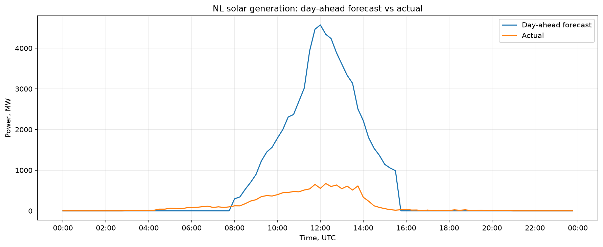
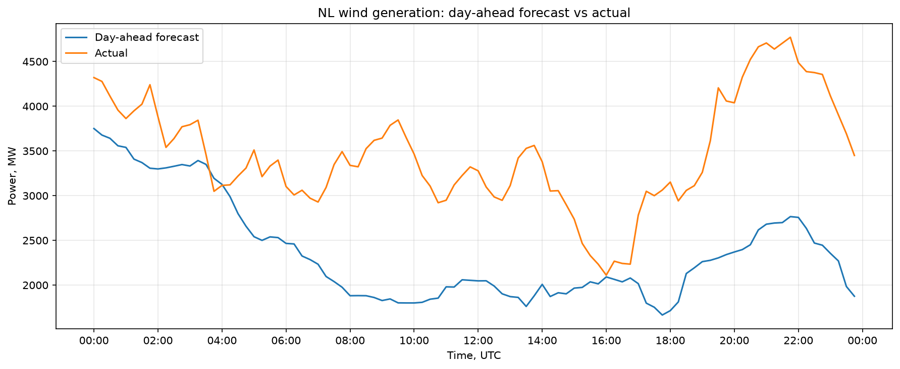
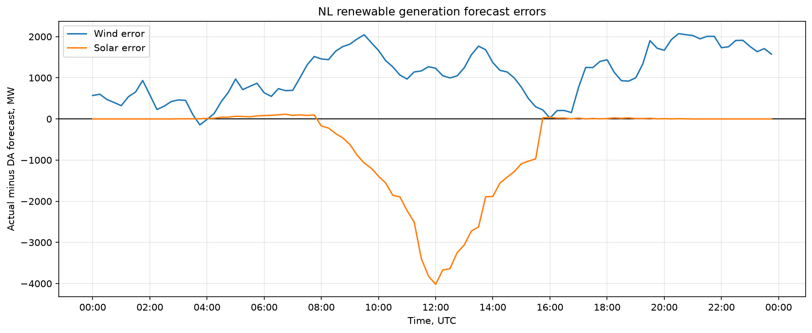
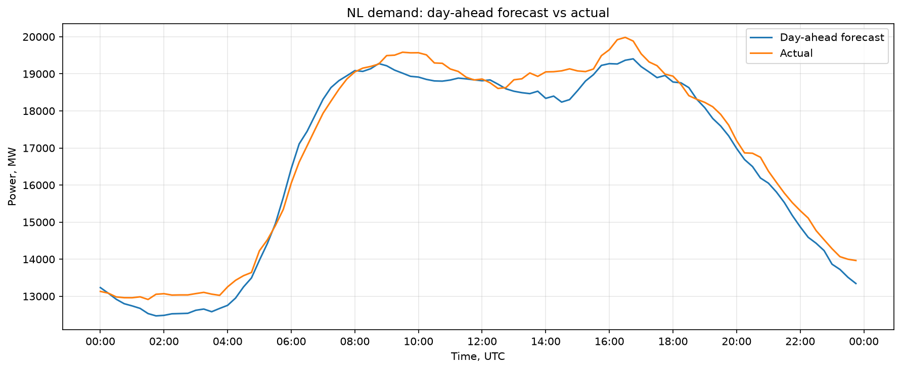
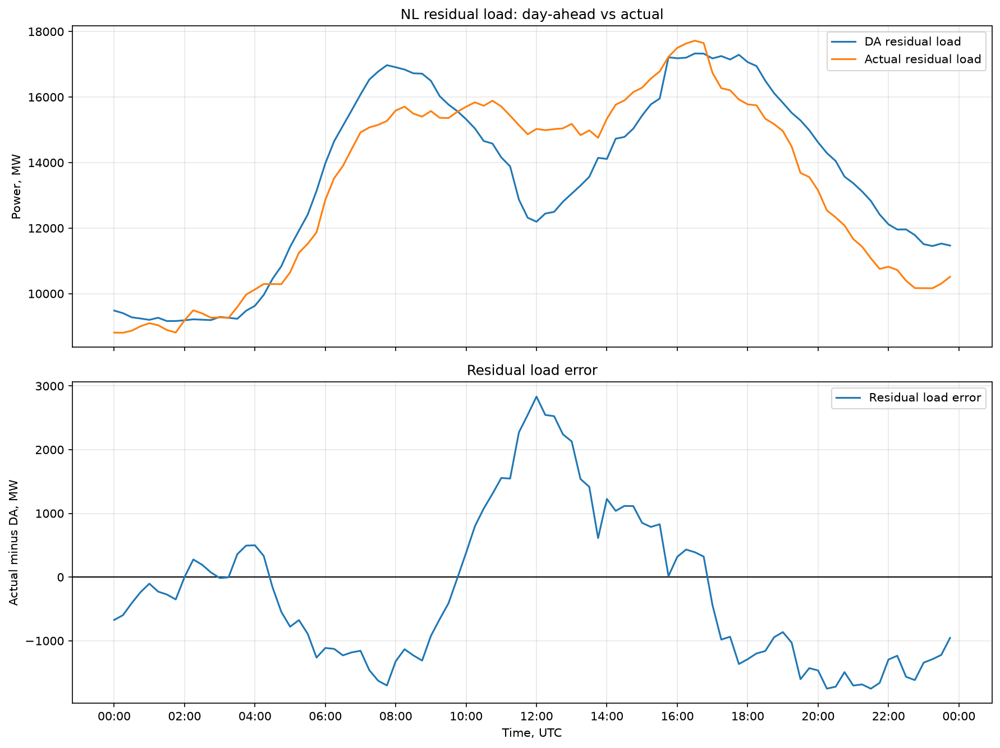

AOX Trade case study

## Q0. Explain the three stages in your own words

The day-ahead market is a call market for short-term delivery contracts. On the afternoon before delivery, market participants submit buy and sell volume-price orders. The auction determines one clearing price for each 15-minute delivery block while generally maximising overall economic surplus. All accepted orders are executed at the same clearing price. The day-ahead price reflects the market's expectations, based on the information available at the time of the auction, about supply and demand during that future delivery period.

After the day-ahead auction clears, there is an intraday market for the same delivery products. Unlike day-ahead, intraday is not a single auction with one clearing price. Trades execute continuously whenever buy and sell orders match. Participants can adjust their positions as new market information arrives. For example, a producer who sold 10 MWh but now expects to generate only 8 MWh can buy 2 MWh of the same delivery product to reduce the expected imbalance exposure. Intraday prices reflect updated expectations relative to day-ahead, including the probability that the system will be short or long at delivery.

The imbalance settlement mechanism can charge or pay participants based on their contribution to the system imbalance. The system can be short or long. If the system is long, additional energy is not needed and a long participant may receive a very low or negative imbalance price for the surplus. If the system is short, TenneT activates upward balancing reserves, which can result in a very high imbalance settlement price. Imbalance prices are based on marginal balancing activations and the applicable settlement rules.

I had never seen this market before, so the imbalance settlement mechanism was the most surprising part for me. I did not realise that the electricity market and settlement system could be so complex, or that generation plus imports must continuously equal consumption plus exports. TenneT's balancing actions can result in very low or negative prices when the system is long and very high prices when the system is short.

The second thing that surprised me was that the day-ahead market is a call market. During my CFA Level I preparation, when I read about this type of market, I did not understand its practical application. Now I can see why this mechanism is useful in the electricity market.

## Data and methodology

### Units and timestamps

The workbook does not explicitly state the unit for the renewable forecast and outturn columns. I interpret them as average MW per 15-minute interval because this interpretation is consistent with installed capacity, demand and flow data.

The workbook states that "UTC is one hour ahead of CET." This appears to be reversed: CET is normally one hour ahead of UTC. I therefore treat the time conversion as a data-quality issue rather than silently applying the workbook statement.

### Processed 15-minute dataset

I merged the solar, wind, demand, day-ahead price and imbalance price sheets into `data/processed/nl_market_15m.csv`. Each row represents one 15-minute delivery interval.

The main forecast errors are calculated as actual minus day-ahead forecast:

```text
solar_error_mw  = solar_actual_mw - solar_da_mw
wind_error_mw   = wind_actual_total_mw - wind_da_mw
demand_error_mw = demand_actual_mw - demand_da_mw
```

Residual load is the part of demand that must be covered by conventional generation, net imports, storage and other sources not included in the wind and solar data:

```text
residual_load_da_mw     = demand_da_mw - solar_da_mw - wind_da_mw
residual_load_actual_mw = demand_actual_mw - solar_actual_mw - wind_actual_total_mw
```

## Q1. Tell us the story of the day

### Solar generation



The graph compares the day-ahead solar generation forecast with actual generation. Between approximately 08:00 and 16:00 UTC, actual solar generation was consistently below forecast, with the largest shortfall around midday.

### Wind generation



The graph compares the day-ahead wind generation forecast with actual generation. Actual wind generation was above forecast for almost the entire day.

### Renewable forecast errors



The graph shows forecast errors for wind and solar, calculated as actual generation minus the day-ahead forecast. Between approximately 10:00 and 16:00 UTC, the positive wind error did not fully offset the negative solar error.

### Demand



The graph compares actual demand with the day-ahead forecast. Actual demand tracked the forecast reasonably closely, although it was slightly higher during most intervals.

### Residual load



Actual residual load was above the day-ahead forecast between approximately 02:00-04:00 and 10:00-17:00 UTC. During these periods, conventional generation, net imports, and other sources had to cover more load than expected. The daytime increase was mainly caused by solar generation falling below forecast, only partly offset by stronger wind generation.

Residual load does not by itself prove that the Dutch system was short. The next step is to check whether cross-border flows and balancing actions compensated for the higher load on other sources.

### Imbalance prices with residual load error


Large positive residual-load errors coincided with sharply higher imbalance prices, suggesting that the additional short pressure was compensated through expensive balancing actions.