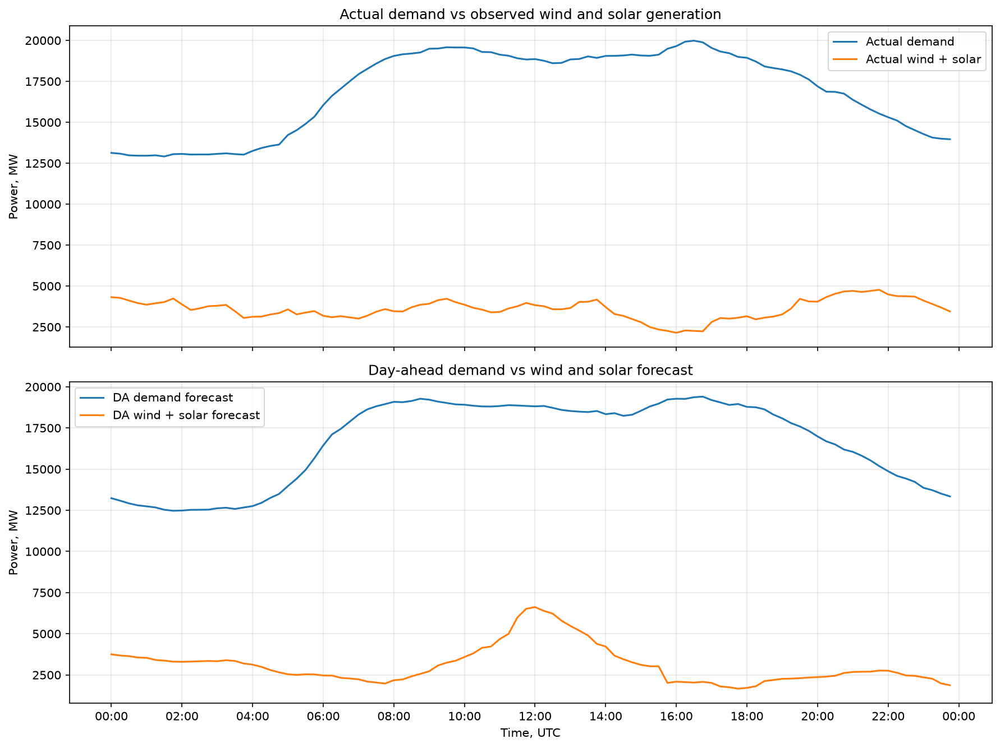
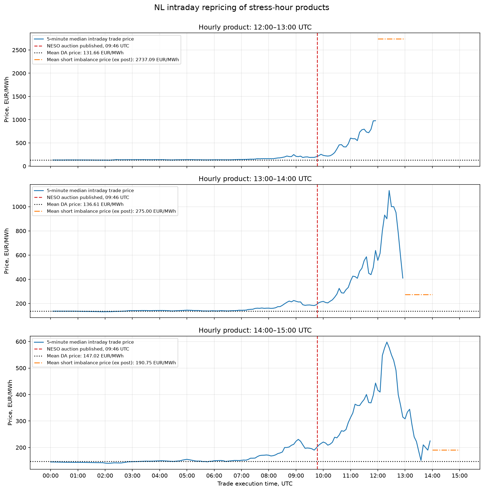
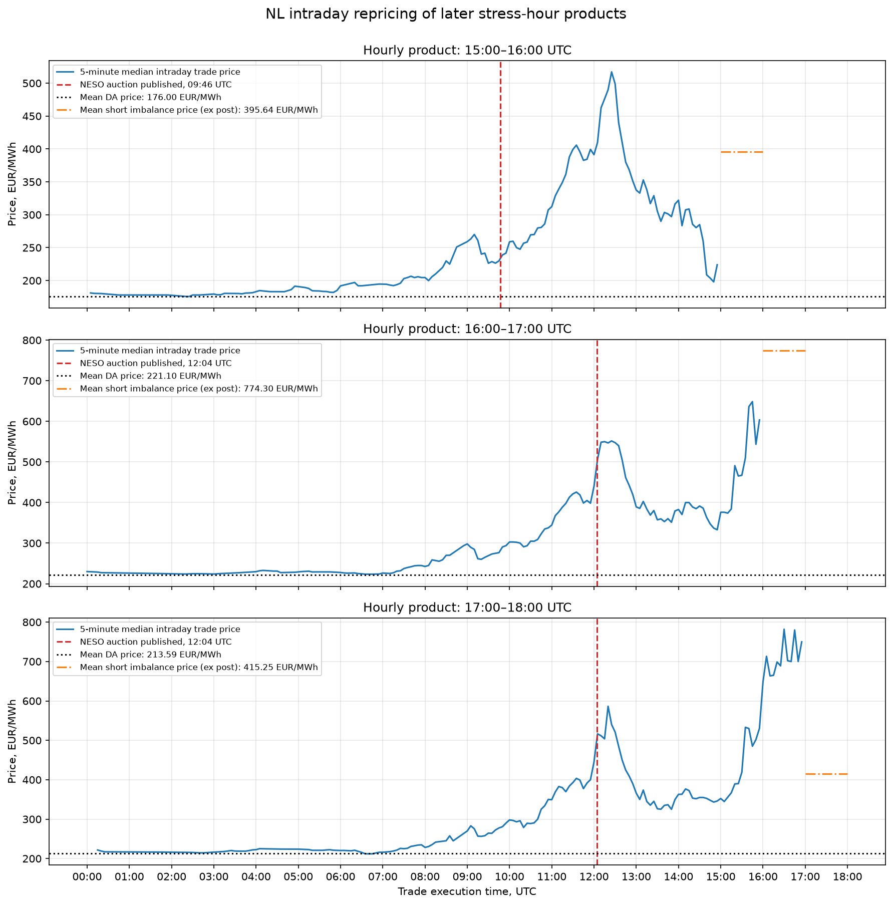

# AOX Trade case study

## Q0. Explain the three stages in your own words

The day-ahead market is a call market for short-term delivery contracts. On the afternoon before delivery, market participants submit buy and sell volume-price orders. The auction determines one clearing price for each 15-minute delivery block while generally maximising overall economic surplus. All accepted orders are executed at the same clearing price. The day-ahead price reflects the market's expectations, based on the information available at the time of the auction, about supply and demand during that future delivery period.

After the day-ahead auction clears, there is an intraday market for the same delivery products. Unlike day-ahead, intraday is not a single auction with one clearing price. Trades execute continuously whenever buy and sell orders match. Participants can adjust their positions as new market information arrives. For example, a producer who sold 10 MWh but now expects to generate only 8 MWh can buy 2 MWh of the same delivery product to reduce the expected imbalance exposure. Intraday prices reflect updated expectations relative to day-ahead, including the probability that the system will be short or long at delivery.

The imbalance settlement mechanism can charge or pay participants based on their contribution to the system imbalance. The system can be short or long. If the system is long, additional energy is not needed and a long participant may receive a very low or negative imbalance price for the surplus. If the system is short, TenneT activates upward balancing reserves, which can result in a very high imbalance settlement price. Imbalance prices are based on marginal balancing activations and the applicable settlement rules.

I had never seen this market before, so the imbalance settlement mechanism was the most surprising part for me. I did not realise that the electricity market and settlement system could be so complex, or that generation plus imports must continuously equal consumption plus exports. TenneT's balancing actions can result in very low or negative prices when the system is long and very high prices when the system is short.

The second thing that surprised me was that the day-ahead market is a call market. During my CFA Level I preparation, when I read about this type of market, I did not understand its practical application. Now I can see why this mechanism is useful in the electricity market.

## Q1. Tell us the story of the day

### Solar and wind generation


The first graph compares the day-ahead solar generation forecast with actual generation. Between approximately 08:00 and 16:00 UTC, actual solar generation was consistently below forecast, with the largest shortfall around midday.

The second graph compares the day-ahead wind generation forecast with actual generation. Actual wind generation was above forecast for almost the entire day.

### Renewable forecast errors


The graph shows forecast errors for wind and solar, calculated as actual generation minus the day-ahead forecast. Between approximately 10:00 and 16:00 UTC, the positive wind error did not fully offset the negative solar error.

### Demand


The graph compares actual demand with the day-ahead forecast. Actual demand tracked the forecast reasonably closely, although it was slightly higher during most intervals.


### Residual load



The difference between demand and observed wind and solar generation is the residual load. It must be covered by conventional generation, net imports, storage, demand response and other sources that are not included in the renewable generation data.


Actual residual load was above the day-ahead forecast between approximately 02:00–04:00 and 10:00–17:00 UTC. During these periods, conventional generation, net imports and other sources had to cover more load than expected. The daytime increase was mainly caused by solar generation falling below forecast, only partly offset by stronger wind generation.

### Imbalance prices with residual load error


Large positive residual-load errors coincided with sharply higher imbalance prices, suggesting that the additional short pressure was compensated through expensive balancing actions.


### Residual load error with export


Cross-border schedules were adjusted before the realised residual-load error appeared, presumably as updated information became available. The largest export reductions then coincided with the strongest positive residual-load errors, but the relationship was not exact.


### Residual error, imbalance prices and import capacity


During the period of the largest positive residual-load error, no additional import capacity was available across the reported borders. This limited the Netherlands’ ability to relieve the system through further cross-border imports.


### Residual error, imbalance prices and total balancing


Imbalance prices tracked the indicative net balancing contribution shown in the Balance Delta feed more closely than residual-load error. Residual load remained elevated after the price spike, but the net balancing contribution fell, suggesting that other generation, flows or market responses had begun to offset the pressure.

### BritNed day-ahead vs finalised schedules and NESO auctions


The NESO auction data explains much of the change in the BritNed schedule. During the main period of Dutch system stress, finalised imports from Great Britain were substantially lower than planned in the day-ahead schedule and sometimes reversed into exports from the Netherlands. NESO had procured energy for the British system through its interconnector auctions, which changed the scheduled BritNed flow. The accepted NESO Buy volumes on BritNed closely match almost all of the large differences between the day-ahead and finalised schedules.

### Intraday prices during the stress periods



The trade tape shows how intraday prices changed for the selected delivery periods.

The 12:00–13:00 UTC hourly product reacted to the NESO auction information. After the results were published, the intraday price began a sustained upward trend. However, it still underestimated the realised imbalance prices for the delivery hour. There may have been a long opportunity during this repricing.

The 13:00–14:00 UTC hourly product also reacted to the NESO auction information. During the 12:00–13:00 delivery hour, its intraday price rose above the imbalance price that was subsequently realised during 13:00–14:00. There may have been a short opportunity once the market began to overestimate how long the system stress would continue.

The 14:00–15:00 UTC hourly product also repriced upwards. As the observed balancing pressure and imbalance prices eased, its intraday price fell back towards its earlier level.

One question remains: why did intraday prices begin to fall after approximately 12:30, and what new information caused this repricing?



The second figure covers a later period of system stress. It was less extreme than the first, but it is still worth investigating.

The NESO auction published around 10:00 contained only a 10 MW BritNed Buy volume for the 15:00–16:00 UTC product, so the auction does not explain its price movement. The intraday price fell as the earlier stress eased, but later underestimated the imbalance prices realised during this delivery hour.

The 16:00–17:00 UTC hourly product was affected by the next NESO auction disclosure at 12:04. Its price rose after the publication and incorporated information from the earlier stress period, but the realised imbalance prices for this delivery hour were still higher.

The 17:00–18:00 UTC hourly product also reflected the earlier information and traded at levels influenced by the preceding imbalance prices. In this case, it overestimated the imbalance prices subsequently realised during its own delivery hour.

## Data and methodology

#### Units and timestamps

The workbook does not explicitly state the unit for the renewable forecast and outturn columns. I interpret them as average MW per 15-minute interval because this interpretation is consistent with installed capacity, demand and flow data.

The workbook states that "UTC is one hour ahead of CET." This appears to be reversed: CET is normally one hour ahead of UTC. I therefore treat the time conversion as a data-quality issue rather than silently applying the workbook statement.

The `isp` column in the Balance Delta sheet runs from 1 to 1,440 and follows the minute sequence of the day rather than resetting every 15 minutes. I therefore use the timestamp columns, rather than `isp`, when aligning and aggregating the data.

#### Processed 15-minute dataset

I merged the solar, wind, demand, day-ahead price and imbalance price sheets into `data/processed/nl_market_15m.csv`. Each row represents one 15-minute delivery interval.

The main forecast errors are calculated as actual minus day-ahead forecast:

```text
solar_error_mw  = solar_actual_mw - solar_da_mw
wind_error_mw   = wind_actual_total_mw - wind_da_mw
demand_error_mw = demand_actual_mw - demand_da_mw
```

Residual load is the part of demand that must be covered by conventional generation, net imports, storage and other sources not included in the wind and solar data:

```text
residual_load_da_mw     = demand_da_mw - solar_da_mw - wind_da_mw
residual_load_actual_mw = demand_actual_mw - solar_actual_mw - wind_actual_total_mw
```

#### Processed cross-border flows

I aggregated the hourly NL flows across the five reported borders (BE, DE, DK, GB and NO) in `data/processed/nl_flows_total.csv`. The sign convention is positive for NL exports and negative for NL imports.

```text
da_net_nl_exports_mw  = total day-ahead scheduled net exports
fin_net_nl_exports_mw = total finalised scheduled net exports
id_adjustment_mw      = fin_net_nl_exports_mw - da_net_nl_exports_mw
```

A negative `id_adjustment_mw` means that exports were reduced or imports were increased relative to the day-ahead schedule. A positive adjustment means that exports increased or imports decreased.

#### Processed transfer capacity

I aggregated the reported transfer capacity in `data/processed/capacities_total.csv`. The source contains capacity for BE, DE, DK and NO, but does not include GB/BritNed.

```text
capacity_to_nl_total   = be_to_nl + de_to_nl + dk_to_nl + no_to_nl
capacity_from_nl_total = nl_to_be + nl_to_de + nl_to_dk + nl_to_no
```

Capacity into NL is positive. Capacity out of NL follows the source's negative convention. These columns represent available commercial transfer capacity, not measured physical flows or fixed cable ratings.

#### Processed Balance Delta data

I calculated signed net contributions for each balancing mechanism in `data/processed/balance_delta_total.csv`. The file keeps the original one-minute frequency. I converted the source CET timestamps to UTC by subtracting one hour, following the assumption explained above.

```text
power_net_afrr_mw    = power_in_afrr_mw - power_out_afrr_mw
power_net_igcc_mw    = power_in_igcc_mw - power_out_igcc_mw
power_net_mfrrda_mw  = power_in_mfrrda_mw - power_out_mfrrda_mw
power_net_picasso_mw = picasso_in_mw - picasso_out_mw

power_net_total_mw = power_net_afrr_mw
                   + power_net_igcc_mw
                   + power_net_mfrrda_mw
                   + power_net_picasso_mw
```

Positive values indicate a net upward contribution in the supplied Balance Delta mechanisms, while negative values indicate a net downward contribution. For comparison with the 15-minute market data, I use the mean of the one-minute MW observations within each 15-minute interval.

#### Processed NL–GB flows and NESO auctions

I isolated the GB border and matched it with the NESO BritNed auction volumes in `data/processed/nl_flows_gb.csv`. Because the auction data can contain several lots for the same delivery hour, I first summed `bn_volume_mw` by `delivery_start_time_utc` and then matched it to the hourly NL–GB flow timestamp.

```text
da_net_nl_exports_mw  = day-ahead scheduled NL net exports to GB
fin_net_nl_exports_mw = finalised scheduled NL net exports to GB
id_adjustment_mw      = fin_net_nl_exports_mw - da_net_nl_exports_mw
neso_buy_mw           = total NESO Buy volume accepted on BritNed
```

The flow columns retain the NL export-positive sign convention. `fin_net_nl_exports_mw` is a finalised commercial schedule, not a measured physical flow.

