# AOX trade case study

## Q0. Explain the three stages in your own words

### Day-ahead market

The day-ahead market is a call market for short-term delivery contracts. On the afternoon before delivery, market participants submit buy and sell volume-price orders. The auction determines one clearing price for each 15-minute delivery block while generally maximising overall economic surplus. All accepted orders are executed at the same clearing price. The day-ahead price reflects the market's expectations, based on the information available at the time of the auction, about supply and demand during that future delivery period.

### Intraday market

After the day-ahead auction clears, there is an intraday market for the same delivery products. Unlike day-ahead, intraday is not a single auction with one clearing price. Trades execute continuously whenever buy and sell orders match. Participants can adjust their positions as new market information arrives. For example, a producer who sold 10 MWh but now expects to generate only 8 MWh can buy 2 MWh of the same delivery product to reduce the expected imbalance exposure. Intraday prices reflect updated expectations relative to day-ahead, including the probability that the system will be short or long at delivery.

### Imbalance settlement mechanism

The imbalance settlement mechanism can charge or pay participants based on their contribution to the system imbalance. The system can be short or long. If the system is long, additional energy is not needed and a long participant may receive a very low or negative imbalance price for the surplus. If the system is short, TenneT activates upward balancing reserves, which can result in a very high imbalance settlement price. Imbalance prices are based on marginal balancing activations and the applicable settlement rules.

### Surprising things

I had never seen this market before, so the imbalance settlement mechanism was the most surprising part for me. I did not realise that the electricity market and settlement system could be so complex, or that generation plus imports must continuously equal consumption plus exports. TenneT's balancing actions can result in very low or negative prices when the system is long and very high prices when the system is short.

The second thing that surprised me was that the day-ahead market is a call market. During my CFA Level I preparation, when I read about this type of market, I did not understand its practical application. Now I can see why this mechanism is useful in the electricity market.

## Q1. Tell us the story of the day

The main event of the day was severe system stress around midday that the day-ahead market had not anticipated. A large solar forecast error, slightly higher demand, limited ability to increase imports across the reported borders and the loss of expected BritNed supply combined to push balancing and imbalance prices to extreme levels.

```text
07:00   export schedules begin to fall below DA
09:46   NESO publishes auction results for 12:00–16:00
10:00   residual-load error turns positive for the delivery interval (observable at 10:15); inbound ATC reaches zero
11:45   imbalance prices enter the extreme range
12:04   second NESO auction results target 16:00–19:00
12:15   imbalance price peaks at €4,358/MWh
12:30   fundamentals and balancing pressure begin to improve
16:15   second, smaller imbalance spike
```

### Solar and wind generation

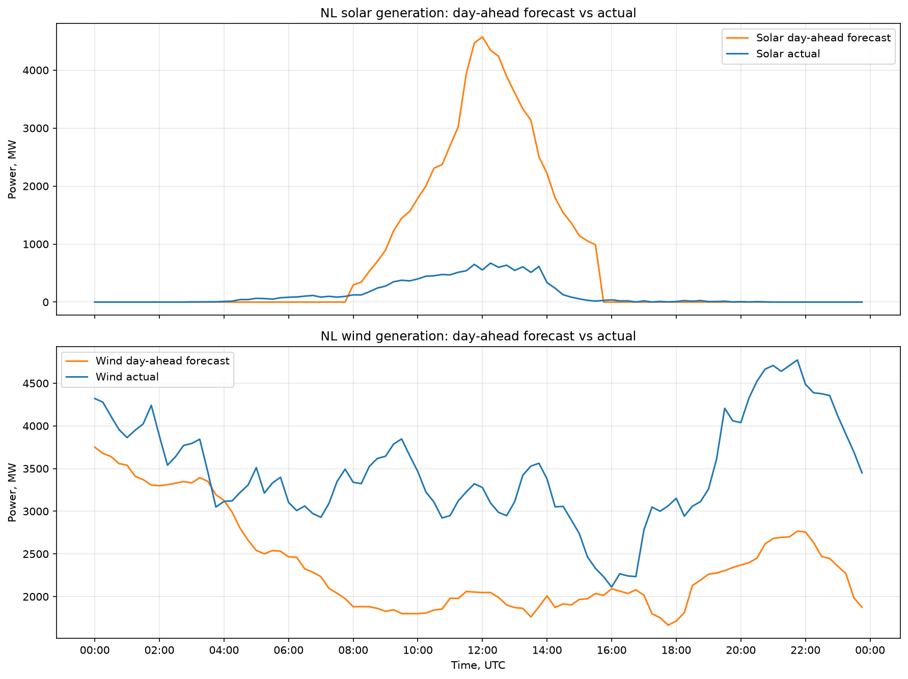

The first graph compares the day-ahead solar generation forecast with actual generation. Between approximately 08:00 and 16:00 UTC, actual solar generation was consistently below forecast. The largest shortfall occurred at 12:00, when the day-ahead forecast was 4,572 MW, actual generation was 554 MW and the forecast error reached −4,018 MW.

The second graph compares the day-ahead wind generation forecast with actual generation. Actual wind generation was above forecast for almost the entire day.

### Renewable forecast errors


The graph shows forecast errors for wind and solar, calculated as actual generation minus the day-ahead forecast. Between approximately 10:00 and 16:00 UTC, the positive wind error did not fully offset the negative solar error.

### Demand


The graph compares actual demand with the day-ahead forecast. Actual demand tracked the forecast reasonably closely, although it was above forecast in 78 of the 96 intervals and the average error was approximately +257 MW.

### Residual load

The difference between demand and observed wind and solar generation is the residual load. It must be covered by conventional generation, net imports, and other sources that are not included in the renewable generation data.


Actual residual load was above the day-ahead forecast between approximately 02:00–04:00 and 10:00–17:00 UTC. During these periods, conventional generation, net imports and other sources had to cover more load than expected. The daytime increase was mainly caused by solar generation falling below forecast, only partly offset by stronger wind generation. Residual-load error reached a maximum of +2,833 MW at 12:00.

### Imbalance prices with residual load error

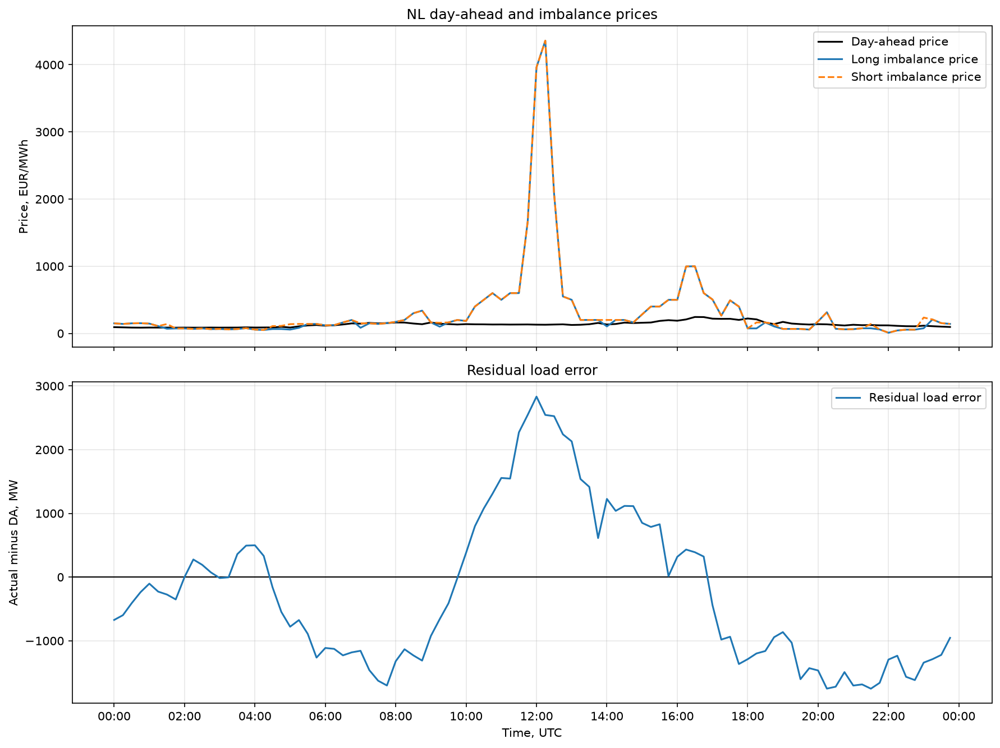

Large positive residual-load errors coincided with sharply higher imbalance prices, suggesting that the additional short pressure was met with expensive balancing actions. The short imbalance price reached €4,358.34/MWh at 12:15, compared with a day-ahead price of €129.21/MWh for the same interval.

### Residual load error with exports

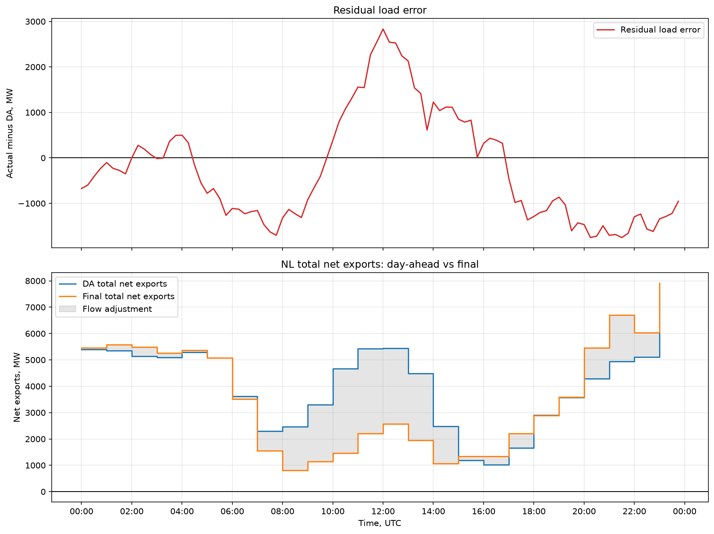

Cross-border schedules were adjusted before the realised residual-load error appeared, presumably as updated information became available. The largest export reductions then coincided with the strongest positive residual-load errors, but the relationship was not exact. At 12:00, day-ahead net exports were 5,434 MW and the finalised schedule was 2,576 MW, a reduction of approximately 2,859 MW. The Netherlands remained a net exporter.

### Residual error, imbalance prices and import capacity

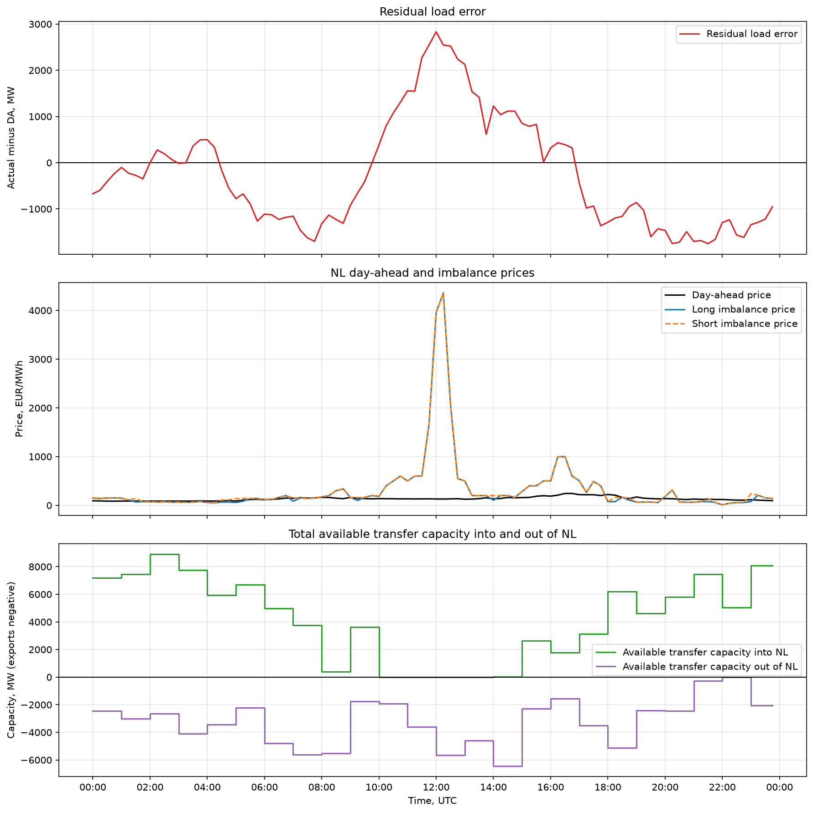

During the period of the largest positive residual-load error, no additional import capacity was available across the reported borders. This limited the Netherlands’ ability to relieve the system through further cross-border imports.

### Residual error, imbalance prices and total balancing

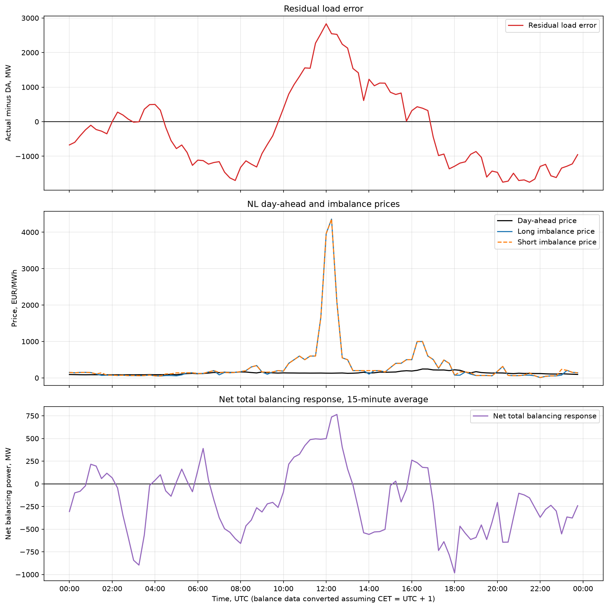

Imbalance prices tracked the indicative net balancing contribution shown in the Balance Delta feed more closely than residual-load error. Residual load remained elevated after the price spike, but the net balancing contribution fell, suggesting that other generation, flows or market responses had begun to offset the pressure.

### BritNed day-ahead vs finalised schedules and NESO auctions

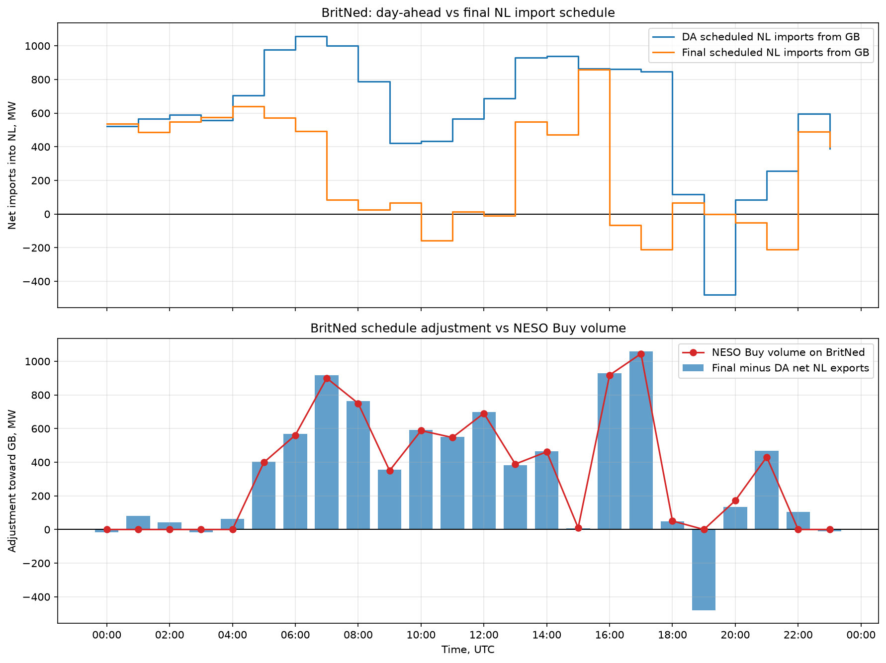

The NESO auction data explains much of the change in the BritNed schedule. During the main period of Dutch system stress, finalised imports from Great Britain were substantially lower than planned in the day-ahead schedule and sometimes reversed into exports from the Netherlands. NESO had procured energy for the British system through its interconnector auctions, which changed the scheduled BritNed flow. At 12:00, the schedule changed from a 687 MW import into the Netherlands to a 10 MW export, a 697 MW swing towards Great Britain. This closely matches the 691 MW NESO Buy volume accepted on BritNed.

### Summary

The following figure summarises the relationship between day-ahead, intraday and imbalance prices over the delivery day. The intraday series uses the final five-minute median price for each continuous quarter-hour product.

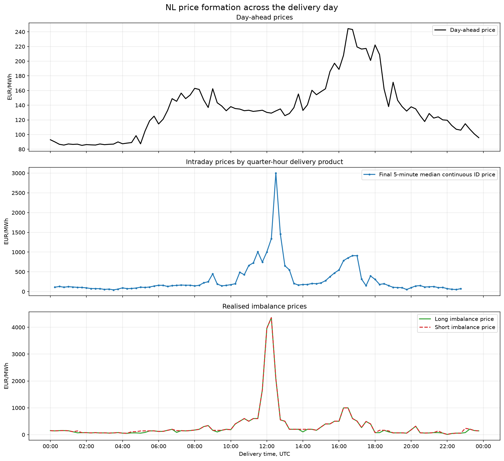

The day-ahead market did not anticipate the severity of the system stress in several delivery periods. Intraday prices moved more closely with imbalance prices because they incorporated information that arrived after the day-ahead auction. I would not describe an intraday price as a pure forecast of the imbalance price, but expected imbalance conditions are an important part of its formation.

**But what about the whole picture of the day?**

Day-ahead expectations for solar generation between approximately 08:00 and 16:00 were much higher than actual generation. Wind generation above forecast did not fully offset the negative solar error. Demand was reasonably close to forecast over the day, but it was higher than expected during several morning and afternoon periods. As a result, residual-load error became strongly positive between approximately 10:00 and 17:00, meaning that conventional generation, net imports and other sources had to cover more load than expected.

Imbalance prices were much higher than day-ahead prices during the main 10:00–14:00 stress period. There were also smaller periods of elevated imbalance prices around 08:00–09:00, 15:00–18:00 and 20:00–20:15. The largest price increases occurred while residual-load error was positive. The day-ahead market had scheduled more exports than were ultimately finalised. Export schedules were substantially reduced between approximately 07:00 and 14:00, leaving more energy in the Netherlands, but the country still remained a net exporter during the main stress period.

Available import capacity across the reported borders fell to zero during most of the extreme-price period. This means that the ability to increase imports further across those borders was exhausted. The Balance Delta feed shows a strong upward balancing response, mainly through aFRR and some mFRRda, with the indicative net contribution reaching roughly 765 MW. This feed does not capture every source that helped balance the system.

NESO auctions removed much of the supply that the Netherlands had expected to import from Great Britain through BritNed. The auction disclosures were followed by higher intraday prices. However, intraday prices did not predict the realised imbalance settlement exactly: they underestimated it in some delivery periods and overestimated it in others.

The extreme imbalance prices therefore appear to have resulted from several factors overlapping: solar generation below forecast, demand slightly above forecast, limited ability to increase imports and the loss of expected BritNed supply after the NESO auctions.

The fall in imbalance prices after the 12:15 peak can be partly explained by the available data. Residual-load error declined from 2,526 MW at 12:30 to 2,241 MW at 12:45 and 1,539 MW by 13:15 as solar generation began to recover and the positive wind error increased. Finalised net exports also fell from 2,576 MW at 12:00 to 1,950 MW at 13:00, leaving more energy in the Netherlands. At the same time, the indicative net Balance Delta contribution dropped from approximately 765 MW at 12:30 to 403 MW at 12:45 and 163 MW at 13:00. TenneT required less upward balancing energy, allowing the system to move towards cheaper balancing bids. However, residual-load error remained high, and the dataset does not show conventional generation or storage dispatch. I can explain why balancing pressure eased, but not identify every source that replaced the missing energy.

## Q2. The biggest opportunities

### Limitations and assumptions

The main limitation is that the dataset covers only one day. It was useful for understanding how this market works, but it is not enough to identify robust trading opportunities, construct a strategy or determine which factors consistently affect prices. I cannot test my hypotheses against historical data or distinguish repeatable relationships from one-off events. I can only form hypotheses about which information might signal an opportunity.

The data pack does not give publication times or reporting delays for most operational series. I therefore use a zero-lag scenario: at each decision time, I assume that completed solar, wind, demand and Balance Delta observations were already visible. I do not use observations from intervals that had not yet finished. I also assume that the reported transfer-capacity data for future delivery hours were live and visible at the decision time. Future actuals, future balancing activations, future imbalance prices and finalised post-intraday schedules do not justify a decision. The signal, stop and take-profit use only information available at the decision time; entry execution is estimated separately from the subsequent trade tape under the conventions described below. Both entry and exit are intraday trades before delivery.

The task does not specify trading capital, so I assume capital of €10,000 and target a loss of 1% of equity at the specified stop level for each opportunity. This is a sizing convention rather than a guaranteed maximum loss: price gaps, limited liquidity and slippage can produce a larger loss. The data cover only one day, which is not enough to estimate an optimal risk percentage or take-profit method statistically. I place each stop where the trade idea would be invalidated and set the take-profit before simulating the later price path. The take-profit method can differ between ideas, but I do not select a target from the known ex-post maximum.

The trades file contains 73,343 unique continuous hourly trades, 100,098 quarter-hour trades and only 262 half-hour trades. I focus first on hourly products because they match the hourly BritNed schedules and NESO auction periods directly. Half-hour products are too thin for the main analysis.

I screened all four NESO disclosures. The first disclosure at 03:18 caused little immediate repricing, while the large move in the 09:00–12:00 products started several hours later without another identifiable signal in the data. I did not treat it as a defensible event-driven trade. I also investigated the 12:04 disclosure, but by the time its reaction could be confirmed, the affected products were already expensive, reported inbound ATC was positive and the current stress indicators were beginning to ease. A normal stop would have been hit before the later recovery, so I excluded that setup rather than forcing a third opportunity.

### Opportunity 1: long 13:00–14:00 after the 09:46 NESO disclosure

The 09:46 disclosure affected the 12:00–16:00 delivery curve. I concentrate on 12:00–13:00, 13:00–14:00 and 14:00–15:00. The auction volume for 15:00–16:00 was only 10 MW, so NESO was not a convincing explanation for that product.

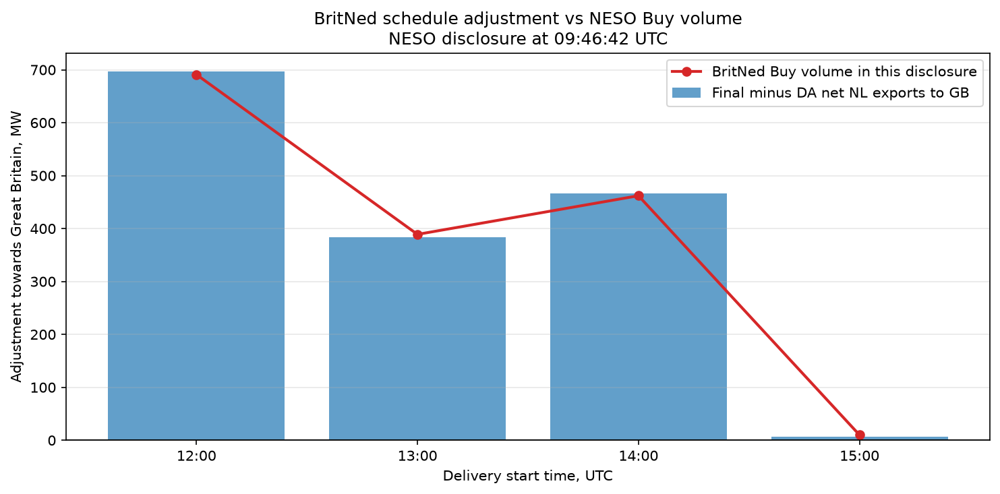

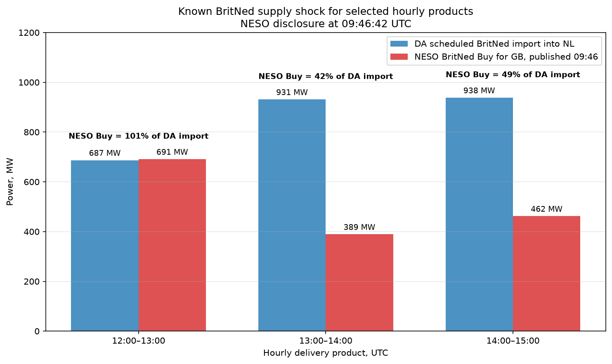

The clearest direct shock was in 12:00–13:00. The Netherlands had scheduled a 687 MW day-ahead BritNed import, while NESO published a 691 MW BritNed Buy for Great Britain. For 13:00–14:00, the NESO Buy was 389 MW against a 931 MW scheduled import. My trade is therefore not based on 13:00–14:00 having the largest direct shock. It is a curve-spillover idea: if the loss of BritNed supply contributed to stress in 12:00–13:00, the next hourly product could reprice while it was still open for intraday trading.

#### When it became identifiable

At 09:46 the auction disclosed the risk, but the current system data did not yet confirm short pressure. Residual-load error was negative and the indicative Balance Delta contribution was below zero. An immediate long would only make sense for a trader who could process the disclosure faster than the rest of the market.

At 10:15, the completed 10:00–10:15 delivery interval made the positive residual-load error observable, but Balance Delta was still slightly negative. This was an early warning rather than enough confirmation for my trade.

I consider the opportunity identifiable at 10:30. By then the latest completed residual-load error had increased to +798 MW, and the indicative net Balance Delta contribution had turned positive at approximately +217 MW. Under this assumption, reported inbound ATC for 12:00–14:00 was zero. These indicators do not prove that the future system would be short, but together with the intraday price and volume move they gave broader confirmation than the auction disclosure alone.

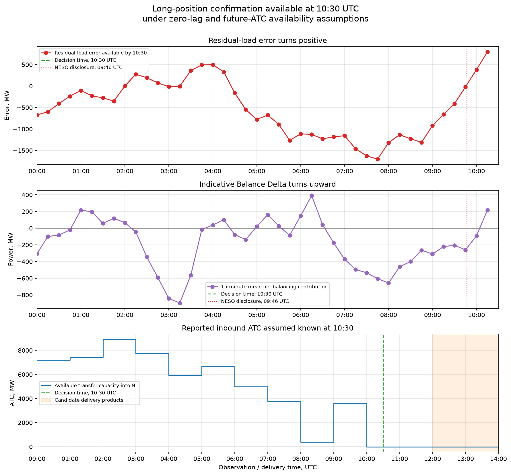

#### Entry and stop, sizing

Trades in the first five-minute window after the decision ranged from €257.60 to €299.00/MWh. The median was €277.90/MWh, based on 47 unique trades and 107.9 MWh of recorded volume. I use €277.90/MWh as an execution proxy for an order submitted after the 10:30 signal; the subsequent five-minute trades are not used to form the trading decision.

I set the stop at €230/MWh, below the last pre-entry breakout area. A return below this level would invalidate the price confirmation. I would also close the position if residual-load error and the indicative Balance Delta reversed, or if substantial inbound capacity became available.

The case does not specify trading capital or portfolio limits, so position size requires an explicit assumption. I assume €10,000 in hypothetical trading capital and risk 1% (€100) on the trade:

```text
risk per MWh = €277.90 − €230.00 = €47.90/MWh
position MWh = €100 / €47.90 = 2.088 MWh
```

The position is rounded to 2.088 MWh. Using that rounded size, a €100 risk budget corresponds to approximately €47.89/MWh of price risk and implies a stop of approximately €230.01/MWh, which is effectively the €230/MWh stop used above.

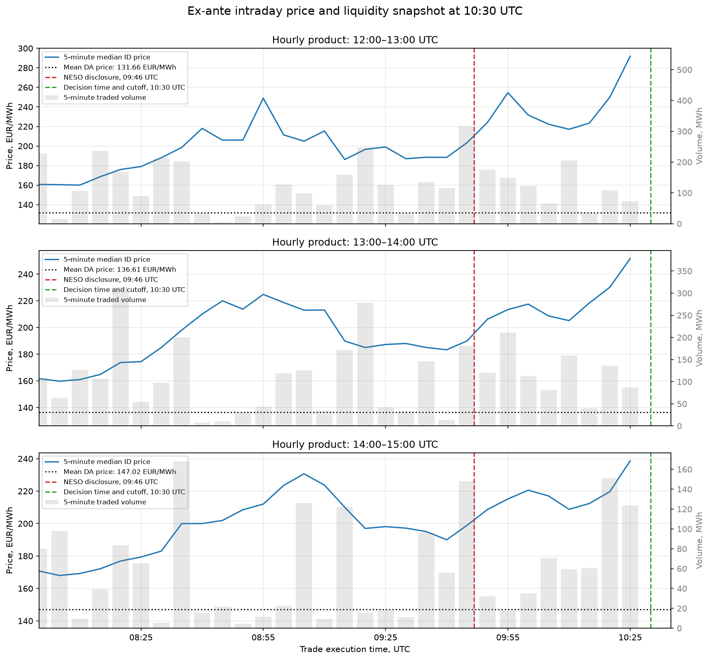

#### Take-profit and time exit

I use three exit rules and close the position when the first one is triggered:

1. a 5R price target;
2. the first upward mFRR direct activation;
3. a time exit at 12:50 UTC, ten minutes before delivery.

The 5R target is a deliberately ambitious return objective rather than a statistically optimised level: a one-day sample cannot support such optimisation. I set it before looking at the subsequent price path:

```text
5R target profit = 5 × €100 = €500
required price increase = €500 / 2.088 MWh = €239.46/MWh
take-profit = €277.90 + €239.46 = €517.36/MWh
```

If the price target is not reached first, an upward mFRR direct activation is an event-based reason to close. My hypothesis is that manual activation signals that the expected deficit has materialised and that TenneT has begun addressing it, so the remaining intraday upside may narrow. If neither condition occurs, I close at 12:50 and do not carry the position into the 13:00 delivery period.

#### Simulated outcome

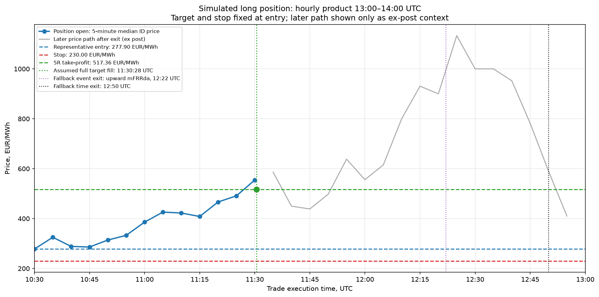

The stop was not touched after entry. The 5R target was the first exit rule to trigger. The first recorded trade above €517.36/MWh occurred at 11:29:50 UTC at €530.16/MWh. That print was only 1 MWh, so I do not assume that the whole position filled immediately. Cumulative recorded volume at or above the target exceeded the 2.088 MWh position at 11:30:28. I use that as the assumed full-fill time for a resting limit sell at €517.36/MWh. The tape still does not show queue position, so actual execution and slippage cannot be proven.

For the hypothetical 2.088 MWh position:

```text
P&L = (€517.36 − €277.90) × 2.088 MWh = approximately €500
```

This is a 5R gain, or 5% of the hypothetical €10,000 capital before fees. TenneT's 199 MW upward mFRR direct activation began later, at approximately 12:22 UTC under my timezone assumption, and the time exit was set for 12:50. Neither fallback rule was used because the 5R target had already closed the position. The higher prices later in the day are shown only as ex-post context and are not included in the P&L.

### Opportunity 2: short after the failed reaction to the 17:28 NESO disclosure

The 17:28 disclosure affected the 20:00–22:00 delivery curve.

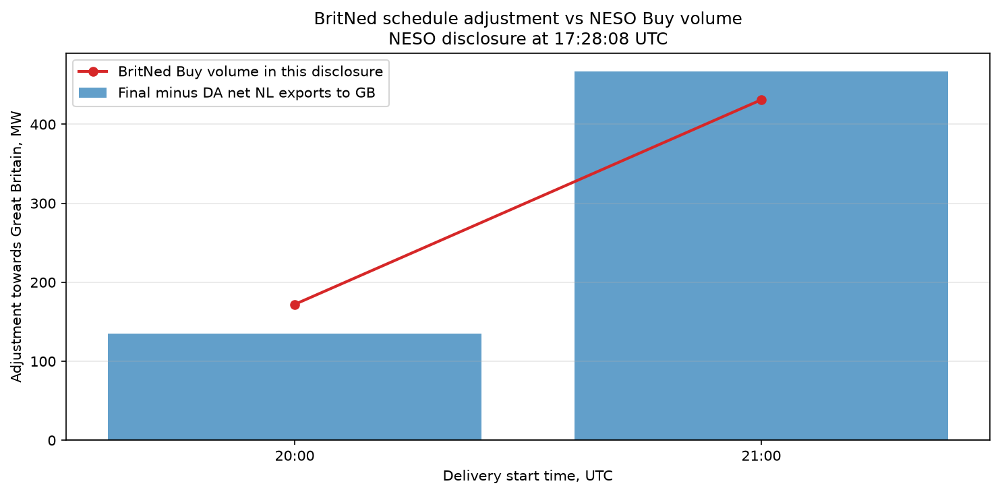

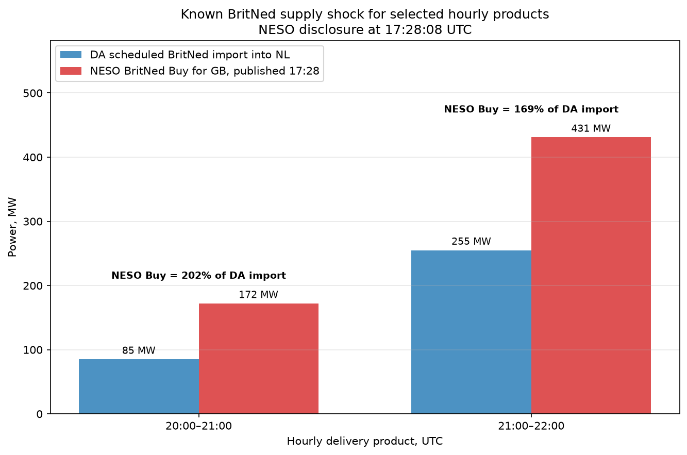

NESO published a 172 MW BritNed Buy for 20:00–21:00 and 431 MW for 21:00–22:00. These volumes were equal to 202% and 169%, respectively, of the Netherlands' scheduled DA BritNed imports. This was bullish information for NL, but it arrived after the intraday market had already repriced the earlier system stress.

#### When it became identifiable

I would not short immediately at 17:28 because the lost BritNed supply was a real bullish risk. Both products initially increased after the disclosure. The 20:00–21:00 median rose from €182.56/MWh during 17:25–17:28 to €192.66/MWh during 17:30–17:35. The 21:00–22:00 median rose from €165.06/MWh to €170.25/MWh.

The reaction then failed. During 17:35–17:40, the medians fell to €188.80/MWh and €167.69/MWh. At the same time, the latest completed residual-load error was −981 MW, and the latest indicative Balance Delta observation was −643 MW.

I consider the short identifiable at 17:40. The trade is not a bet that the NESO Buy was irrelevant. My thesis is based on the fundamental indicators signalling that the midday stress was ending, the relatively high prices of these contracts and the lack of a sustained bullish reaction after the NESO Buy disclosure.

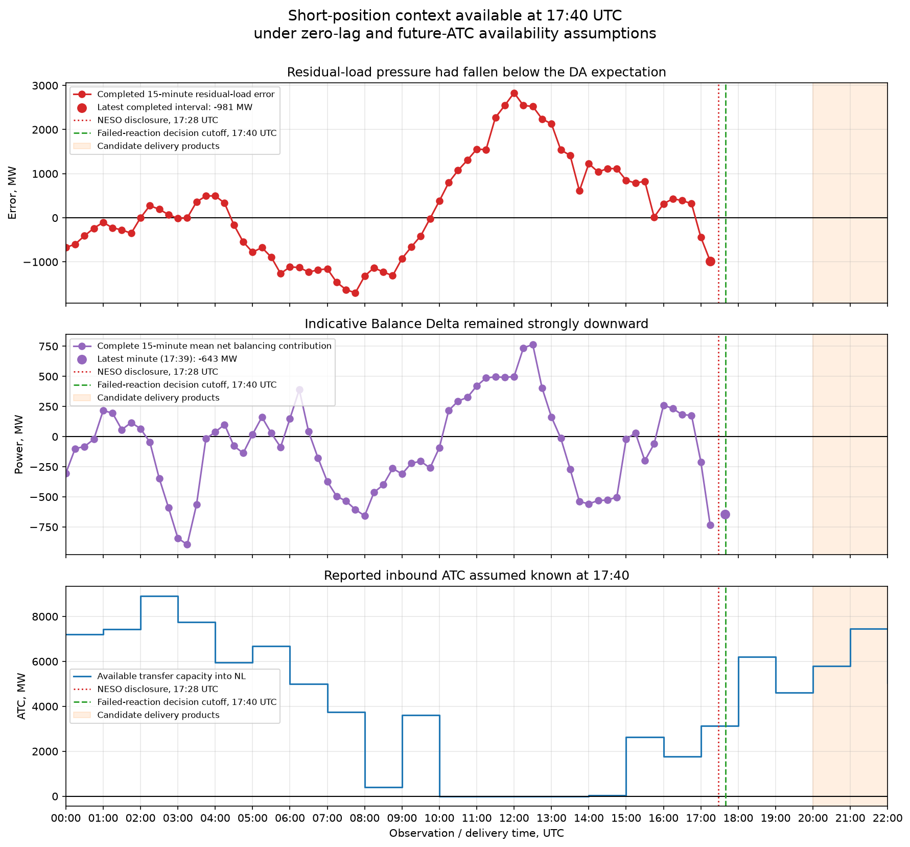

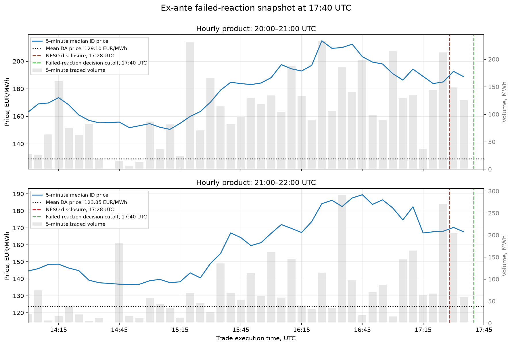

#### Entry, stop and sizing

I split the planned €100 stop-loss budget equally between the two affected products. For each leg, I use the median execution price in the first five-minute window after the 17:40 decision as a proxy for an order submitted after the signal; these subsequent trades are not used to form the decision.

For 20:00–21:00, the 17:40–17:45 median was €185.20/MWh. The window contained 23 unique trades and 11.7 MWh, with prices from €177.00 to €190.30/MWh. I place the stop at €200/MWh, above the post-disclosure reaction high:

```text
risk per MWh = €200.00 − €185.20 = €14.80/MWh
position MWh = €50 / €14.80 = 3.378 MWh
```

For 21:00–22:00, the representative entry was €163.88/MWh. The entry window contained 37 unique trades and 45.9 MWh, with prices from €158.00 to €170.00/MWh. I place the stop at €175/MWh:

```text
risk per MWh = €175.00 − €163.88 = €11.12/MWh
position MWh = €50 / €11.12 = 4.496 MWh
```

For these one-hour products, the MWh exposure equals the MW position for one hour. Both proposed sizes are small relative to the recorded entry-window volume, but the tape does not prove order-book depth or eliminate slippage risk.

#### Take-profit and time exit

The target is a return to the price area before the system stress began at approximately 10:00. I use the median of all executions from the start of trading until 10:00 and round it to the nearest €5/MWh. The median is less sensitive than the mean to isolated extreme prints. The pre-stress medians were €129.00/MWh for 20:00–21:00 and €118.28/MWh for 21:00–22:00, giving targets of €130/MWh and €120/MWh. If a target is not reached, I close the corresponding leg ten minutes before delivery, at 19:50 or 20:50. A move above €200 or €175 invalidates the failed-reaction thesis and triggers the stop first.

#### Simulated outcome

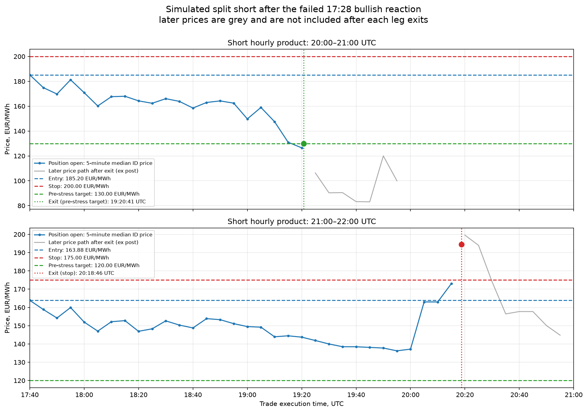

The two legs produced different results. For 20:00–21:00, the first trade below the €130/MWh target occurred at 19:15:49. Recorded volume at or below the target accumulated to the 3.378 MWh position by 19:20:41. I assume a resting limit buy closed the short at €130/MWh once sufficient tape volume had traded through the level:

```text
P&L = (€185.20 − €130.00) × 3.378 MWh
    = +€186.47
```

The 21:00–22:00 product did not reach its €120/MWh target. It later moved above the €175/MWh stop. The first print above the stop was only 0.1 MWh at €194.55. The tape does not show the order book, so the full-size stop execution cannot be reconstructed. To avoid understating the loss by waiting for later, more favourable prints, I use the first observed breach price of €194.55/MWh as a conservative exit proxy for the full position:

```text
P&L = (€163.88 − €194.55) × 4.496 MWh
    = −€137.89
```

The combined result is approximately +€48.57 before fees, or +0.49R relative to the planned €100 stop-loss budget. The closer 20:00–21:00 contract returned to its pre-stress price area, but the later contract showed that the stress-duration thesis did not hold across the whole curve. The 21:00–22:00 leg lost more than its planned €50 allocation because the first observed price beyond the stop was already €194.55/MWh. This gap also shows why tape-only execution assumptions are fragile: actual slippage could have been better or worse than this conservative proxy.

## Q3. Pick one sheet you found most informative and one you found least

The most informative sheet for finding trading opportunities was `neso_auctions`. It contains genuinely new information that can change expectations for future delivery periods. It also provides an exact disclosure time, affected delivery hours and accepted BritNed volumes. This made it possible to reconstruct what was known before an entry instead of guessing when the information became available.

The least informative sheet for my analysis was `gb_flows`. It covers only the GB–NL border, while the same BritNed schedules were already available within `nl_flows`, together with the other Dutch borders. The sheet was useful as a cross-check, but it added less new information than the other datasets.

## Q4. Take a look at the trades sheet

The first microstructure issue is that the raw tape cannot be treated as one row per execution. The continuous tape contains 195,680 rows but only 173,703 unique `trade_id` values. I therefore remove repeated `trade_id` records before calculating trade counts or volume.

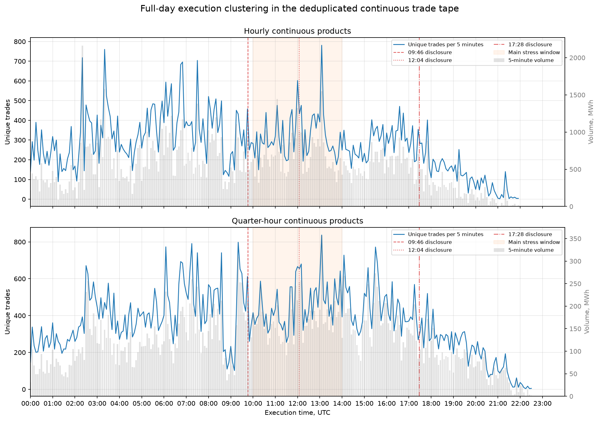

The volume profile does not make the main stress period easy to identify. Volumes during the stress were broadly comparable with those in ordinary hours, so volume alone would not have revealed the severity of the system conditions.

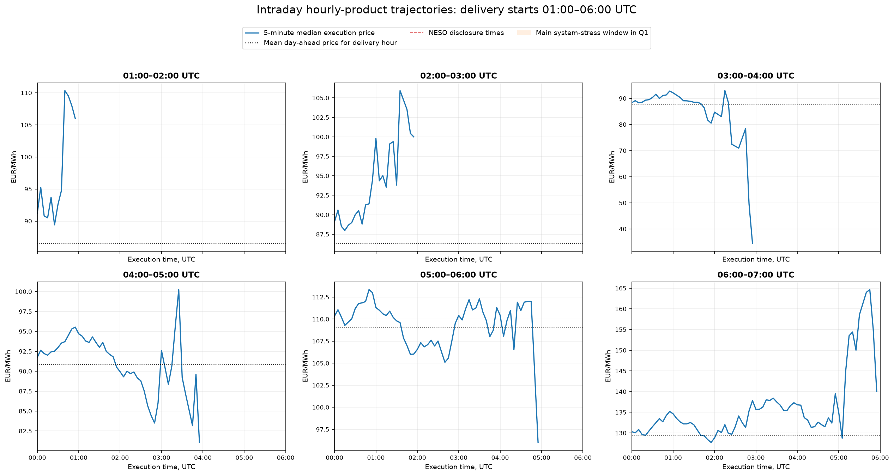

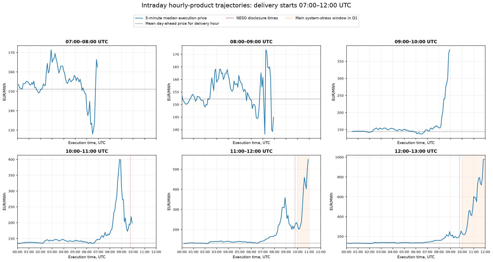

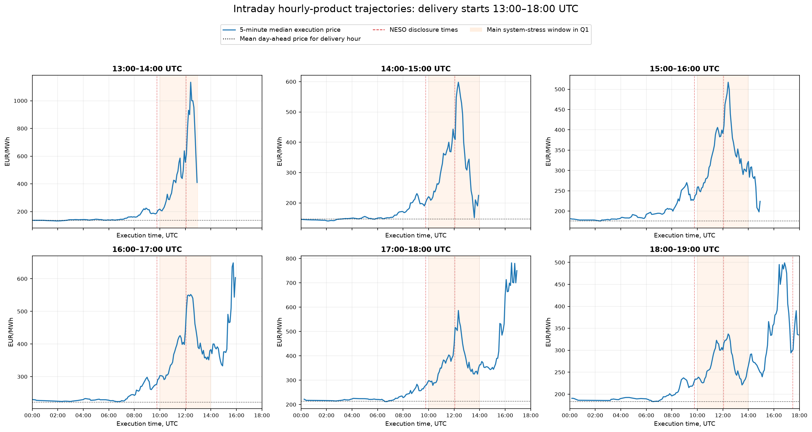

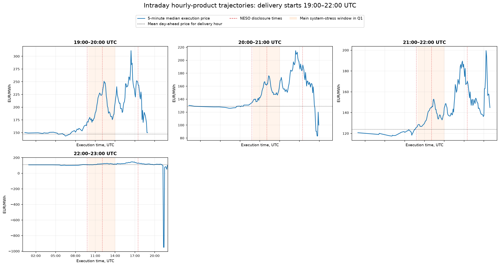

The hourly intraday trajectories show two further patterns. First, the 22:00–23:00 contract traded at extremely negative prices shortly before delivery. Second, substantial price movements were not confined to the stress period: the morning products were volatile too. The evening products also repriced during the midday stress, although the more distant delivery hours generally moved less.

The tape contains 140 unique trades at negative prices. Their distribution across delivery periods is:

```text
delivery_start_time_utc  delivery_end_time_utc
22:00:00                 23:00:00                 126
22:30:00                 22:45:00                  11
03:15:00                 03:30:00                   2
22:00:00                 22:30:00                   1
```

The total volume traded at negative prices was 151.675 MWh. The 22:00–23:00 hourly contract accounted for 143.7 MWh, or 94.7% of the total negative-price volume. The episode lasted only about 30 seconds, so it did not represent sustained repricing. It could reflect a data issue or an isolated microstructure event; with the available data, I would not treat it as a trading opportunity.

Taken together, the price trajectories support the midday stress story in Q1, but the volume profile and the brief late negative-price episode show that not every feature of the tape can be explained by that story.

## Q5. What did you not have time for

With more time, I would investigate more quarter-hour and half-hour products and compare their reactions to each disclosure systematically. The case contains only one market day, which is not enough to construct or validate a trading strategy. With a longer historical sample, I would test whether failed disclosure reactions and mFRRda activations produce repeatable intraday patterns rather than treating this day as representative.

I would also want the historical order book, publication timestamps and reporting delays for the operational datasets. These would allow me to estimate executable depth and slippage, reconstruct the trader's information set more accurately and remove the zero-lag assumption used in Q2. Conventional generation, storage dispatch and timestamped schedule updates would help explain which resources replaced the missing energy as the midday balancing pressure eased.

## Data and methodology

#### Units and timestamps

The workbook does not explicitly state the unit for the renewable forecast and outturn columns. I interpret them as average MW per 15-minute interval because this interpretation is consistent with installed capacity, demand and flow data.

The workbook states that "UTC is one hour ahead of CET." This appears to be reversed: CET is normally one hour ahead of UTC. For comparison with the UTC market data, I use the standard assumption that CET is one hour ahead of UTC and subtract one hour from the Balance Delta timestamps. I treat this as an assumption because the calendar date is anonymised.

The `isp` column in the Balance Delta sheet runs from 1 to 1,440 and follows the minute sequence of the day rather than resetting every 15 minutes. I therefore use the timestamp columns, rather than `isp`, when aligning and aggregating the data.

#### Processed 15-minute dataset

I merged the solar, wind, demand, day-ahead price and imbalance price sheets into `data/processed/nl_market_15m.csv`. Each row represents one 15-minute delivery interval.

The main forecast errors are calculated as actual minus day-ahead forecast:

```text
solar_error_mw  = solar_actual_mw - solar_da_mw
wind_error_mw   = wind_actual_total_mw - wind_da_mw
demand_error_mw = demand_actual_mw - demand_da_mw
```

Residual load is the part of demand that must be covered by conventional generation, net imports, storage and other sources not included in the wind and solar data:

```text
residual_load_da_mw     = demand_da_mw - solar_da_mw - wind_da_mw
residual_load_actual_mw = demand_actual_mw - solar_actual_mw - wind_actual_total_mw
```

#### Processed cross-border flows

I aggregated the hourly NL flows across the five reported borders (BE, DE, DK, GB and NO) in `data/processed/nl_flows_total.csv`. The sign convention is positive for NL exports and negative for NL imports.

```text
da_net_nl_exports_mw  = total day-ahead scheduled net exports
fin_net_nl_exports_mw = total finalised scheduled net exports
id_adjustment_mw      = fin_net_nl_exports_mw - da_net_nl_exports_mw
```

A negative `id_adjustment_mw` means that exports were reduced or imports were increased relative to the day-ahead schedule. A positive adjustment means that exports increased or imports decreased.

#### Processed transfer capacity

I aggregated the reported transfer capacity in `data/processed/capacities_total.csv`. The source contains capacity for BE, DE, DK and NO, but does not include GB/BritNed.

```text
capacity_to_nl_total   = be_to_nl + de_to_nl + dk_to_nl + no_to_nl
capacity_from_nl_total = nl_to_be + nl_to_de + nl_to_dk + nl_to_no
```

Capacity into NL is positive. Capacity out of NL follows the source's negative convention. These columns represent available commercial transfer capacity, not measured physical flows or fixed cable ratings.

#### Processed Balance Delta data

I calculated signed net contributions for each balancing mechanism in `data/processed/balance_delta_total.csv`. The file keeps the original one-minute frequency. I converted the source CET timestamps to UTC by subtracting one hour, following the assumption explained above.

```text
power_net_afrr_mw    = power_in_afrr_mw - power_out_afrr_mw
power_net_igcc_mw    = power_in_igcc_mw - power_out_igcc_mw
power_net_mfrrda_mw  = power_in_mfrrda_mw - power_out_mfrrda_mw
power_net_picasso_mw = picasso_in_mw - picasso_out_mw

power_net_total_mw = power_net_afrr_mw
                   + power_net_igcc_mw
                   + power_net_mfrrda_mw
                   + power_net_picasso_mw
```

Positive values indicate a net upward contribution in the supplied Balance Delta mechanisms, while negative values indicate a net downward contribution. For comparison with the 15-minute market data, I use the mean of the one-minute MW observations within each 15-minute interval.

#### Processed NL–GB flows and NESO auctions

I isolated the GB border and matched it with the NESO BritNed auction volumes in `data/processed/nl_flows_gb.csv`. Because the auction data can contain several lots for the same delivery hour, I first summed `bn_volume_mw` by `delivery_start_time_utc` and then matched it to the hourly NL–GB flow timestamp.

```text
da_net_nl_exports_mw  = day-ahead scheduled NL net exports to GB
fin_net_nl_exports_mw = finalised scheduled NL net exports to GB
id_adjustment_mw      = fin_net_nl_exports_mw - da_net_nl_exports_mw
neso_buy_mw           = total NESO Buy volume accepted on BritNed
```

The flow columns retain the NL export-positive sign convention. `fin_net_nl_exports_mw` is a finalised commercial schedule, not a measured physical flow.

#### Intraday price used in the full-day comparison

For the full-day price comparison, I use continuous quarter-hour products so that day-ahead, intraday and imbalance prices refer to the same 15-minute delivery intervals. After removing duplicate BUY and SELL records with the same `trade_id`, I calculate the median execution price in each five-minute window and use the final available window before delivery as the intraday price. The trade tape contains continuous quarter-hour trades for 91 of the 96 delivery periods; missing periods are left blank rather than estimated.
